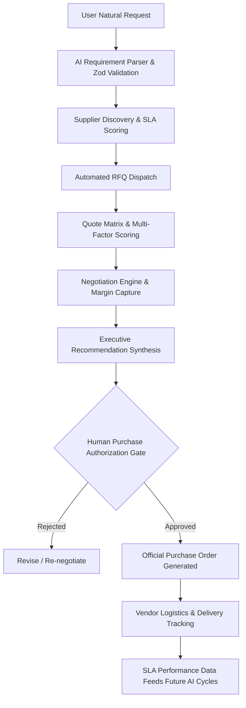

# ProcureAI — Autonomous AI Procurement Agent for Modern Enterprises

[](https://opensource.org/licenses/MIT)
[](https://www.typescriptlang.org/)
[](https://reactjs.org/)
[](https://tailwindcss.com/)
[](https://nodejs.org/)

**ProcureAI** is an enterprise-grade autonomous AI Procurement Agent. It acts as an **AI employee for procurement**, executing the end-to-end buying workflow while keeping **humans strictly in control over company spending and final purchase approvals**.

---

## 🌟 Key Features

* **Autonomous Procurement Employee**: Turns natural language requests (e.g., *"Find 50 ergonomic office chairs under $12,000 delivered to Delhi in 30 days"*) into structured procurement criteria with Zod validation.
* **Supplier Discovery & Ranking**: Evaluates vendor catalogs, geographic fulfillment hubs, and historical reliability ratings.
* **Automated RFQs & Quotation Matrix**: Dispatches requests for quotes, ingests vendor proposals, and computes weighted multi-criteria scores across price, lead times, warranties, and compliance.
* **Autonomous Negotiation Engine**: Identifies volume discount levers and concessions (e.g. 8%+ target discount) with fast PO-close incentives.
* **Human-in-the-Loop Governance**: The AI never autonomously spends money. Executive approval is mandatory to commit corporate funds.
* **Purchase Order Generation**: Generates compliant, printable purchase orders with itemized tables and cryptographic signatures.
* **Vendor Intelligence & Analytics**: Live directory with SLA ratings, order history, and executive spend/savings analytics.
* **⌘K Global Command Palette**: Instant keyboard navigation and grounded AI assistant querying live procurement records.

---

## 🏗️ Architecture & Sourcing Lifecycle



---

## 📁 Repository Structure

```text
procureai/
├── client/                      # Vite + React + TypeScript + Tailwind + Aceternity UI
│   ├── src/
│   │   ├── components/
│   │   │   ├── aceternity/      # Spotlight, BackgroundGrid, BentoGrid, GlowingCard
│   │   │   └── layout/          # AppLayout, CommandPalette
│   │   ├── pages/               # Landing, Dashboard, NewProcurement, Workspace, Approvals, POs, Vendors, Analytics
│   │   ├── services/            # Axios API client with JWT interceptor
│   │   └── lib/                 # Utils & currency formatting
│   └── package.json
├── server/                      # Express + TypeScript + MongoDB + Mongoose + AI Agents
│   ├── src/
│   │   ├── ai/                  # RequirementParser, SupplierAgent, QuoteAgent, NegotiationAgent, RecommendationAgent, Orchestrator
│   │   ├── controllers/         # Auth, Procurement, Workflow
│   │   ├── models/              # User, Company, Vendor, ProcurementRequest, Quote, Negotiation, Approval, PurchaseOrder
│   │   ├── middleware/          # JWT authentication and company tenant data isolation
│   │   ├── routes/              # Express API router
│   │   └── scripts/             # Realistic enterprise demo seed script
│   └── package.json
├── .env.example
└── README.md
```

---

## 🚀 Getting Started

### Prerequisites

* Node.js 18+ & npm
* MongoDB (Optional: the application connects to local/Atlas MongoDB or falls back to robust memory state for interactive demoing)

### Installation

1. **Clone the repository:**
   ```bash
   git clone <repo_url>
   cd "Procurement Ai"
   ```

2. **Install dependencies:**
   ```bash
   # Install server dependencies
   cd server && npm install

   # Install client dependencies
   cd ../client && npm install
   ```

3. **Configure Environment Variables:**
   Copy `.env.example` to `server/.env`:
   ```bash
   PORT=5000
   NODE_ENV=development
   CLIENT_URL=http://localhost:5173
   MONGODB_URI=mongodb://localhost:27017/procureai
   JWT_SECRET=super_secret_procureai_enterprise_jwt_key_2026_x89f
   ```

4. **Run the Application:**
   ```bash
   # Start Server (from server directory)
   npm run dev

   # Start Frontend (from client directory)
   npm run dev
   ```
   Open `http://localhost:5173` in your browser.

5. **Quick Demo Login:**
   * **Email**: `karan@acmetech.com`
   * **Password**: `password123`
   * Or simply click **"Explore Live Demo"** on the landing page.

---

## 🧪 Testing

Run the automated test suite:
```bash
cd server
npm test
```
All 5 core AI engine test suites validate requirement schema parsing, vendor matching, multi-criteria quote matrices, negotiation drafting, and recommendation synthesis.

---

## 🔒 Security & Data Isolation

* Multi-tenant data segregation keyed by `companyId`.
* Password hashing with `bcryptjs`.
* Stateless JWT authorization tokens.
* Helmet headers, CORS policies, and rate limiting.

---

© 2026 ProcureAI Technologies Inc. All rights reserved.
